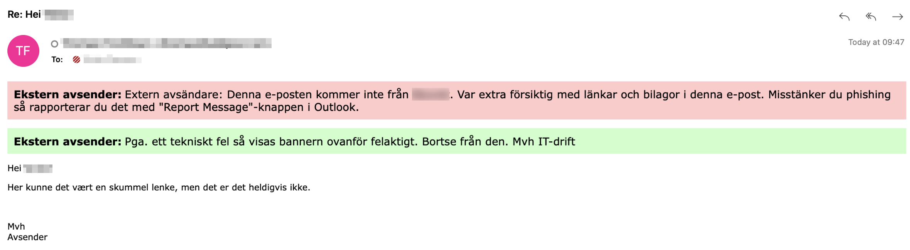
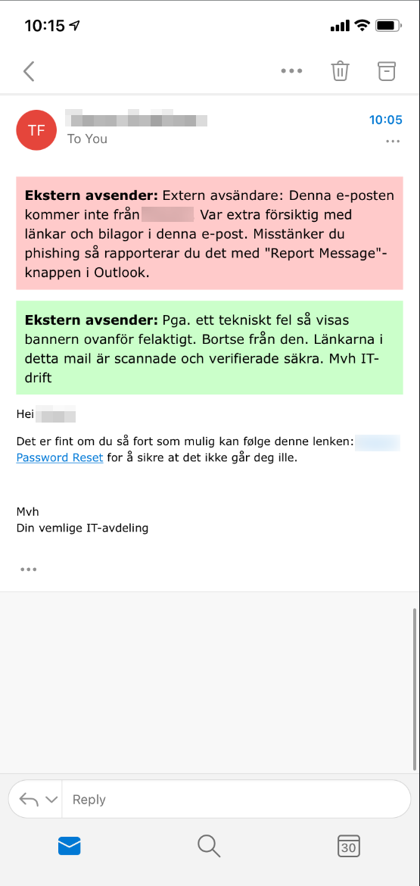
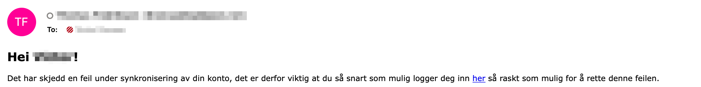

Administrators of Microsoft 365 sometimes make rules to mark emails coming from external sources, this is done in an attempt to make it easier to spot phishing emails. But how hard is it really to circumvent this?

## A typical alert

The HTML for a typical alert may look like this is:

```html
<p style="border:1 px; border-style:solid; border-color: #FFCACA; background-color: #FFCACA; padding: 0.5em;"> <span style=font-size:12.0pt;color:black;><b>Ekstern avsender:</span></b> <span style=font-size:12.0pt;color:black>E-posten kommer fra en ekstern avsender, vær ekstra forsiktig med lenker og vedlegg i denne e-posten. Bruk report message knappen i Outlook hvis du mistenker phishing.</span></p>
```

This basically alert the user that this email is coming from an external source, and that it should be reported if it looks like phishing.

If it's added as a _add header_ mail flow rule, it's simply added to the top of the message.

What if we add our own to the top of our phishing email?

```html
<p style=" border:1 px; border-style:solid; border-color: #CAFFCA; background-color: #CAFFCA; padding: 0.5em;"> <span style=font-size:12.0pt;color:black;><b>Denne meldingen kommer fra en trygg avsender, alle lenker er verifisert sikre. Mvh IT-drift</span></p>
```

This adds a green header with a text saying that the message has been verified as safe, and that all links have been verified.

With slightly different messages, this will look something like this in the email client:





## Let's try to make it go away

What if we don't like the alert? We can actually just add a negative margin to our alert, and put it on top of the injected alert!

But we can do better than that! Let's take it one step further, and remove the alert all together:

```html
<style>
  p {
    display: none !important;
  }
</style>
<h2>Hei xxx!</h2>
<p style="display: block !important;">
  Det har skjedd en feil under synkronisering av din konto, det er derfor viktig
  at du så snart som mulig logger deg inn <a href="http://aaaa">her</a> så raskt
  som mulig for å rette denne feilen.
</p>
```

This will simply hide the alert, thus making it look like the email came from an internal address.



If we want to make it even worse, we could remove the alert and add our own saying the email has been verified.

## The issue

The alert is simply added to the HTML already controlled by the attacker, making it very easy to change/hide.

The real issue however is when we train the users to look for banners like this, which subconsciously will make them think that the lack of a banner equals safe. Which will increase the success rate for a phishing campaign that is successful in hiding it.

Another issue is how the Outlook client blurs the line between the user interface and the email content. There is no separation, making it easy to create fake alerts that appears to be a part of the user interface.
